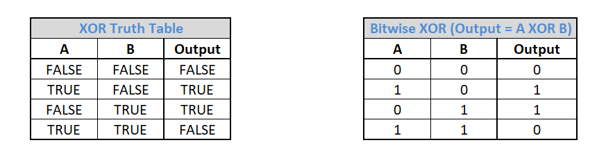
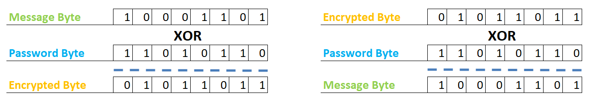
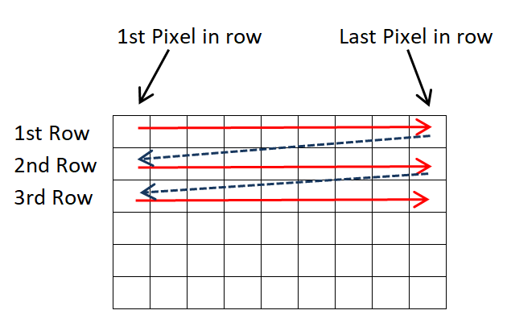
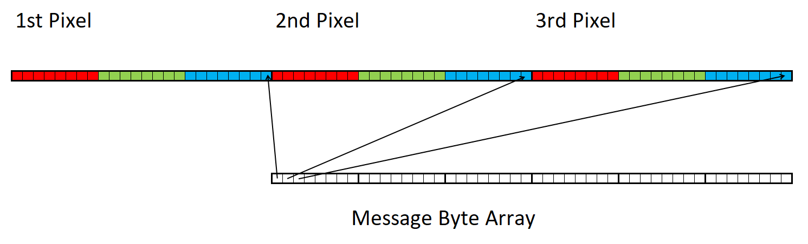
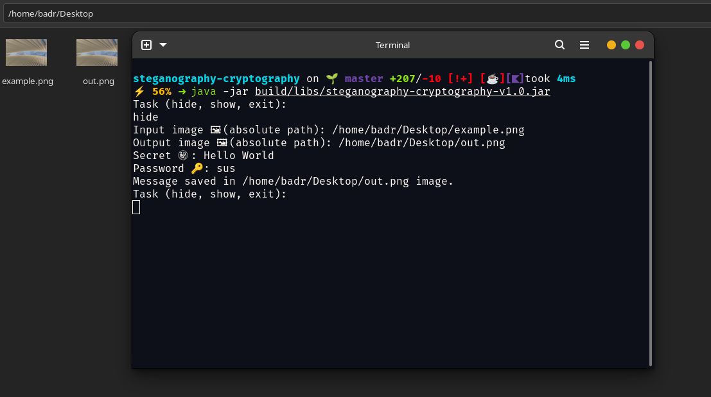
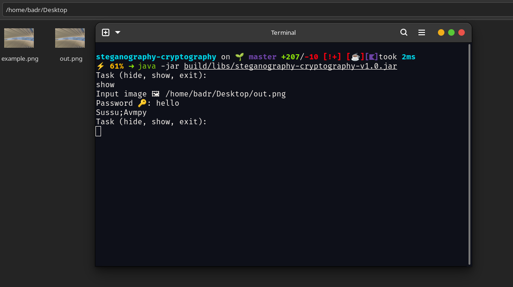

# Steganography and Cryptography - Text in Image

## About

Encryption is sometimes not enough to secure you secrets,
as your secret is known to be passed the only problem is the key is unknown,
but that's only one Wall of protection, a smarter way is to hide your secret in plain sight,
How can you do that? I hear you asking, **Answer** is **Steganography**, with it, you can Hide your secret
after being encrypted in a picture, that would be anywhere on the web, and only you and the receiver would know how to
extract this secret.

## Overview

This App is straight forward, it works both ways:

- injecting secrets, require
    - Path to an Image
    - Path to output Image with secret hidden in it
    - Secret obviously
    - Password to encrypt the secret to ensure that even if the message is extracted it wouldn't be known without the
      password
- extracting secrets
    - Path to Image with secret
    - Password to decrypt the extracted secret

## Encryption

Exclusive OR (XOR) is a logical operation whose output is only true when its inputs differ.
XOR can also be used on data bits where `1` stands for `true` and `0` stands for `false`.
Below you can find both the XOR truth table (on the left) with the input and output values of the XOR operation and the
XOR bitwise operation (on the right).

XOR has an interesting mathematical feature: A XOR B = C and C XOR B = A. If A is the message and B the password, then C
is the encrypted message. Using B and C, we can reconstruct A.
Below is an example where we use Bytes as a message, a password, and an encrypted message:

Thus, not only the same password can be used for encryption and decryption **(symmetric encryption)**, but also the same
simple method.
This encryption is very strong if the password is random and has the same size as the message.

## Injection Algorithm

I used [LSB Technique](https://www.ijltet.org/wp-content/uploads/2015/02/60.pdf) to Hide The Secret, but I only use the
blue channel

The message to hide has the String type and **UTF-8 charset**.
As a result, the message can be in any language.
In order to conceal the secret message, I converted The message to ByteArray and Then stored each byte bits in the Image
respectively, as in figure below

Then Added three bytes (0,0,3) to denote the end of the message

## Disclaimer

Although Steganography is a promising way for securing data,
the algorithm used in this program is primitive and can easily be detected via **Steganalysis**

## Screenshots

### How to Inject Your secret in an Image

### Extracting Secret With Correct Password

### Extracting Secret With Wrong Password

### Image Before and After Injection

#### Before

#### After

**Fun Fact**
You'll see a Japanese Symbol [㊙](https://en.wiktionary.org/wiki/%E7%A7%98) When Entering Your Secret Which also Means
Secret
